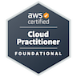

## Hi there 👋

🎓 Bachelor of ICT, majoring in Software Technology at Swinburne University  
🧠 Passionate about fullstack development and modern web technologies  
💻 Working with Vue, Node.js, MySQL, Bootstrap, PHP, and Python  
🚀 Currently developing a care facility management system for my final year project  
🔍 Actively looking for internship opportunities in 2025

### Certifications

### Projects

- **OECD Freshwater Sustainability Visualizer**  
  An interactive data visualization tool that analyzes freshwater sustainability trends in OECD countries. Built with D3.js and Node.js, and deployed on Vercel.  
  [Live Demo](https://cos-30045-lemon.vercel.app/) | [GitHub Repository](https://github.com/Takeruso/COS30045-personal)

<!--
**Takeruso/Takeruso** is a ✨ _special_ ✨ repository because its `README.md` (this file) appears on your GitHub profile.

Here are some ideas to get you started:

-->
